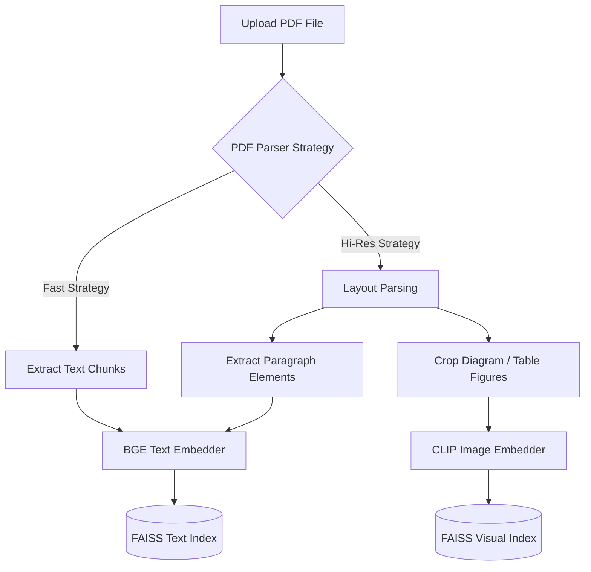
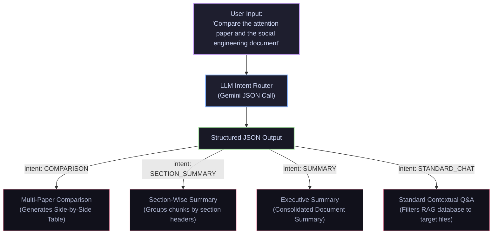
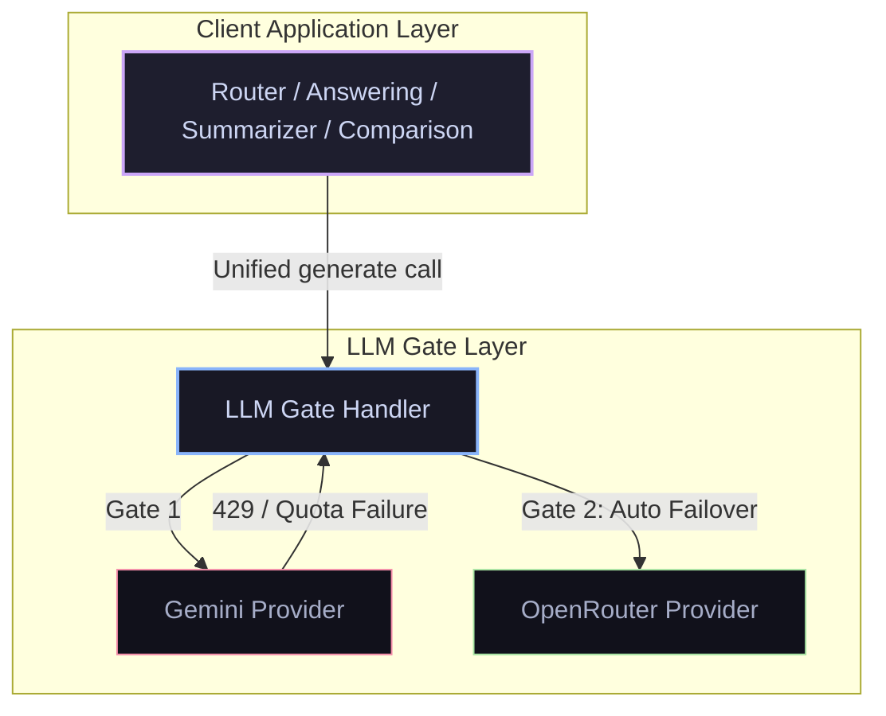

# 📚 Multimodal Multi-PDF Research Assistant (RAG)

A professional, modular Research Paper analysis assistant driven by **Retrieval-Augmented Generation (RAG)**. This system supports layout-aware PDF ingestion, dual-store FAISS indexing (Text + Diagrams/Charts), cross-encoder reranking, and an intelligent LLM-based query intent router.

---

## 🛠️ System Architecture

The following diagram illustrates the hybrid RAG retrieval pipeline and visual processing flow:



---

## 🤖 LLM Intent Router & Context Filtering

Instead of hardcoded keyword checks, queries are routed through a dynamic **LLM Intent Router** powered by Gemini. This allows resolving natural language file references ("summarize the last two papers") and applying precise target document filters during search.



---

## 🛡️ High-Availability LLM Gate Architecture

To ensure zero downtime when running under restricted free-tier API quotas, all LLM requests are managed by a **Unified LLM Gate Handler**. If the primary gate fails (due to 429 quota exhaustion or rate limits), the handler dynamically redirects subsequent queries to the secondary gate without user intervention.



You can view the full design diagram at [docs/llm_gate_architecture_diagram.png](file:///Users/nanibayanaboina2750/Desktop/research-rag-assistant/docs/llm_gate_architecture_diagram.png).

---

## ✨ Features

*   **Multimodal RAG Retrieval:** Fetches both high-relevance paragraphs and visual diagrams/charts, attaching figures natively to the Gemini generation payload.
*   **High-Availability OpenRouter Fallback:** Automatically switches to OpenRouter API (converting visual diagrams to base64 JPEG data URIs) if the primary Google Gemini keys hit rate limits or quota boundaries.
*   **Non-Blocking Indexing:** Runs PDF layout parsing and indexing inside background worker threads, keeping the Streamlit UI completely responsive.
*   **Section-Wise Summaries:** Group chunks by section header metadata to provide detailed section summaries.
*   **Multi-Paper Comparisons:** Side-by-side comparison tables analyzing methodology, contributions, and limits across multiple documents.
*   **CLIP Threshold Filtering:** Filters out unrelated visual results using a cosine similarity threshold of `0.28`.
*   **Cross-Encoder Reranking:** Re-evaluates chunk relevance using a MiniLM Cross-Encoder to optimize RAG accuracy.

---

## 📂 Project Structure

```
research-rag-assistant/
├── config.py                 # Central configurations (models, paths, index dimensions)
├── main.py                   # Master CLI subcommand entry point
├── app/                      # Web dashboard application
│   ├── components/           # Modular UI widgets
│   │   ├── chat.py           # Chat bubble rendering & RAG routing execution
│   │   ├── sidebar.py        # File uploads, strategy select, background threads
│   │   └── router.py         # LLM-based intent routing & reference resolution
│   └── ui.py                 # Minimal Streamlit entry point
├── src/                      # RAG Package Source
│   ├── core/
│   │   ├── generator/        # Gemini client wrapper, Q&A, and summarization
│   │   ├── ingestion.py      # PDF parsing and document layouts
│   │   ├── chunker.py        # Element chunking & section tagging
│   │   ├── embedder.py       # Local BGE and CLIP embedding generation
│   │   └── vector_store.py   # FAISS dual index database management
```

---

## 🚀 Quickstart

### 1. Installation
Install dependencies in a virtual environment:
```bash
pip install -r requirements.txt
```

### 2. Configure Environment
Create a `.env` file in the root directory:
```env
GEMINI_API_KEY=your_gemini_api_key_here
```

### 3. Launch the Dashboard
Run the Streamlit web dashboard:
```bash
python main.py ui
```
