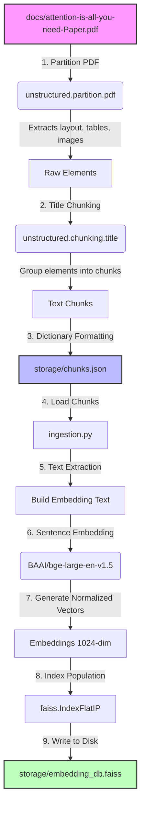

# Phase 5: Ingestion Pipeline

This phase is responsible for document ingestion, parsing, chunking, embedding generation, and vector indexing. It takes raw research documents (like PDFs) and transforms them into a structured format to populate a high-performance vector index database.

## Architecture & Flow

The ingestion pipeline converts unstructured PDF documents into vector embeddings. Below is the workflow diagram illustrating the architecture:

### 1. Document Extraction & Structure (Commented Section)
The commented-out code block (Lines 18-76) represents the initial pipeline ingestion step:
*   **PDF Partitioning:** Uses `unstructured.partition.pdf` (`partition_pdf`) with a high-resolution strategy (`"hi_res"`) to detect layout sections, extract tables (parsing them as HTML), and extract embedded images (saving them as base64 payloads).
*   **Hierarchical Chunking:** Uses `chunk_by_title` to group structural elements into coherent textual chunks based on document headings.
*   **JSON Formatting:** Formats each chunk into a dictionary (`chunk_to_dict`) containing:
    *   `chunk_id`: Unique index identifier.
    *   `text`: Main textual content.
    *   `page`: Original page number in the PDF.
    *   `images`: Associated base64 images and OCR text.
    *   `tables`: Extracted tables containing HTML and text data.
*   The final output is saved to [chunks.json](../storage/chunks.json).

### 2. Vector Indexing (Active Section)
The active code block loads the structured chunks and creates the vector database:
*   **Loading Chunks:** Reads the pre-processed chunks from `../storage/chunks.json`.
*   **Dense Embeddings:** Uses the `BAAI/bge-large-en-v1.5` model via `sentence_transformers` to encode chunk text. The embeddings are normalized, which allows Inner Product (`faiss.IndexFlatIP`) similarity searches to function as Cosine Similarity searches.
*   **FAISS Indexing:** Adds the normalized 1024-dimensional embeddings to a `faiss.IndexFlatIP` index.

---

## Detailed Code Walkthrough

### Active Lines
*   **Lines 12-14:** Initializing the `SentenceTransformer` model using `BAAI/bge-large-en-v1.5`.
*   **Lines 77-78:** Loading `chunks.json` from the shared `storage/` directory.
*   **Lines 80-81:** Helper function `build_embedding_text` retrieves the main raw text from the chunk dictionary for embedding.
*   **Line 83:** Creating a FAISS Inner Product index (`faiss.IndexFlatIP`) with dimension 1024.
*   **Lines 87-100:** Iterating through all chunks, generating normalized float32 embeddings, reshaping each vector to shape `(1, 1024)`, and adding it to the FAISS index.

### Commented-Out Lines Explained
*   **Lines 18-24 (`partition_pdf` call):** Parsed the raw PDF from `../docs/attention-is-all-you-need-Paper.pdf`. The options enabled high-resolution processing and extracted images as base64 strings embedded directly in metadata.
*   **Line 26 (`chunk_by_title` call):** Organized the raw parsed elements into structured sections using section headings to group related paragraphs.
*   **Lines 28-57 (`chunk_to_dict` helper):** Formatted unstructured elements into clean JSON objects. It mapped sub-elements categorized as `Image` or `Table` to child arrays under the parent chunk, preserving OCR results and raw HTML tables.
*   **Lines 62-76:** Populated the chunks array and wrote them to disk as `chunks_json_form.json`. 
*   **Lines 107-111 (`faiss.write_index` block):** Code to save the FAISS database to disk. In a production pipeline, this saves the generated index as `embedding_db.faiss` in the storage directory. It is commented out here because the index has already been pre-generated and stored inside the shared `storage/` directory.
