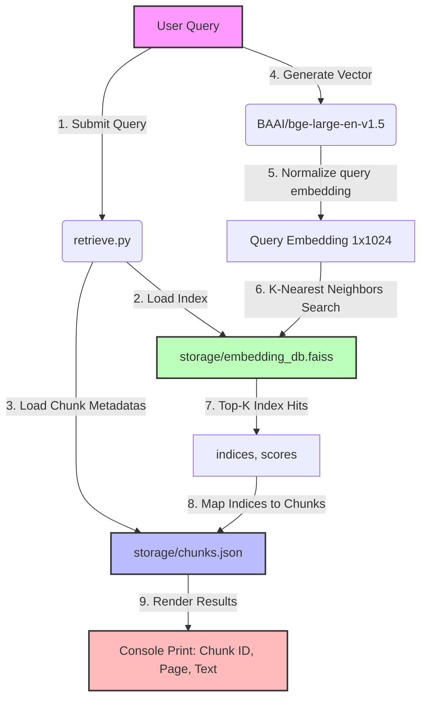

# Phase 6: Retrieval Pipeline

This phase is responsible for taking a user's natural language query, processing it, querying the FAISS vector database to retrieve the most contextually relevant document chunks, and returning those chunks to the user.

## Architecture & Flow

The retrieval pipeline processes a user query and returns matching documents. Below is the workflow diagram illustrating the architecture:

### Retrieval Mechanics
1.  **Index & Text Loading:** The script initializes the search state by loading the vector index from [embedding_db.faiss](../storage/embedding_db.faiss) and the mapped chunk contexts from [chunks.json](../storage/chunks.json).
2.  **Query Representation:** The user's query text is encoded using the same `BAAI/bge-large-en-v1.5` SentenceTransformer model. Crucially, the query vector is normalized (`normalize_embeddings=True`) and reshaped to `(1, 1024)` to align with the normalized document embeddings stored in the database.
3.  **FAISS Querying:** A Top-K similarity search ($k=5$) is performed on the FAISS database using inner product scoring.
4.  **Metadata Association:** The integer index identifiers returned by FAISS are mapped directly to indices in `all_chunks`. This fetches the original source page and text snippet to print them.

---

## Detailed Code Walkthrough

### Active Lines
*   **Lines 8-10:** Initializing the `SentenceTransformer` model using `BAAI/bge-large-en-v1.5`.
*   **Lines 13-15:** Loading the vector database from the shared `storage/embedding_db.faiss` directory.
*   **Lines 20-21:** Loading the raw chunk text mapping from the shared `storage/chunks.json` directory.
*   **Lines 28-34:** Defining a sample search query and encoding/normalizing it.
*   **Line 36:** Reshaping the embedding array to shape `(1, -1)` (equivalent to `(1, 1024)`) so that it can be searched.
*   **Line 40:** Performing the search for the top 5 matches, returning similarity scores and their indices.
*   **Lines 53-57:** Iterating through the match indices, mapping them back to the source chunks list, and displaying the **Chunk ID**, **source PDF Page Number**, and the **first 500 characters** of the matching text.

### Commented-Out Lines Explained
*   **Lines 17 & 23 (Debug Prints):** Used to verify the integrity of the loaded FAISS index and the JSON chunks file during debugging. They print the count of loaded vectors and JSON blocks.
*   **Lines 47-50:** Leftover print statements from previous phases where small mock text lists were searched instead of the actual PDF index.
*   **Line 51:** A simple execution completion check message.
